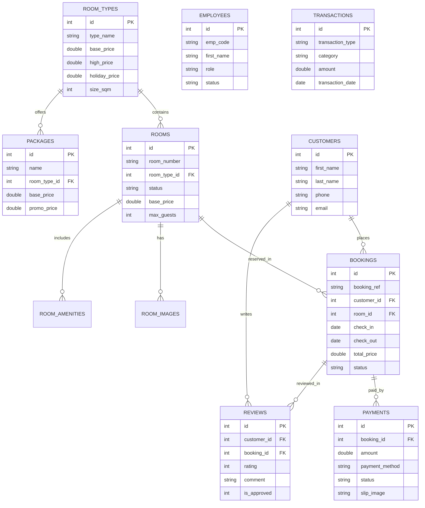

# 🏔️ Yuncha Valley Resort - ระบบเว็บไซต์จองห้องพักและบริหารจัดการรีสอร์ท

เอกสารสรุปโครงการสำหรับการนำเสนอ (Presentation Brief & System Documentation) รวบรวมจากข้อมูลจริงในระบบ พัฒนาขึ้นเพื่อให้เข้าใจง่ายสำหรับผู้ใช้งานทั่วไปและผู้บริหารโดยไม่ต้องมีความรู้ด้านเทคนิค/การเขียนโค้ด

---

## 1. ชื่อโครงการ (Project Name)

** Yuncha Valley Resort Ban Rak Thai **

---

## 2. กลุ่มเป้าหมาย (Target Audience)

แบ่งออกเป็น 2 กลุ่มหลัก ได้แก่:

1. **ผู้ใช้บริการ / ลูกค้าผู้เข้าพัก (Guests & Customers)**
   - นักท่องเที่ยวที่ต้องการค้นหาห้องพัก ดูภาพบรรยากาศ อ่านรีวิว และตรวจสอบราคา/วันว่าง
   - ผู้ที่ต้องการจองห้องพัก ชำระเงิน อัปโหลดสลิป และติดตามสถานะการจองได้สะดวกตลอด 24 ชั่วโมง
   - ผู้ต้องการสอบถามข้อมูลรีสอร์ท กิจกรรม นโยบายการเข้าพัก ผ่านผู้ช่วย AI อัจฉริยะ (รองรับทั้งภาษาไทยและภาษาอังกฤษ)
2. **เจ้าหน้าที่และผู้บริหารรีสอร์ท (Resort Staff & Admin)**
   - **แผนกต้อนรับ (Frontdesk):** ดูผังห้องพักเรียลไทม์ ทำรายการเช็คอิน (Check-in), เช็คเอาท์ (Check-out) และรับลูกค้า Walk-in
   - **ผู้จัดการและเจ้าของกิจการ:** ดูภาพรวมการดำเนินงาน สถิติรายได้ ยอดการจอง ตรวจสอบรายงานทางการเงิน และอนุมัติรีวิว
   - **แผนกบัญชี/การเงิน:** ตรวจสอบสลิปการชำระเงิน บันทึกรายรับ-รายจ่าย และออกใบเสร็จรับเงิน

---

## 3. แนวคิดการออกแบบ (Design Concept)

- **หน้าบ้านสำหรับลูกค้า (Customer Website UI):**
  - **แนวคิด:** *Luxury & Nature Glassmorphism* เน้นความหรูหรา เรียบง่าย กลมกลืนกับธรรมชาติและบรรยากาศไร่ชา/แม่น้ำ/ภูเขา
  - **การใช้งาน:** เมนูน้อย ไม่ซับซ้อน (Clean Navigation) กดจองห้องพักได้ภายในไม่กี่ขั้นตอน รองรับการเปลี่ยนภาษา TH/EN สะดวกบนมือถือ
- **หลังบ้านสำหรับพนักงาน (Admin & Frontdesk Dashboard):**
  - **แนวคิด:** *Modern Cyberpunk / Dark Neon Theme* เน้นความสบายตาขณะทำงานยาวนาน
  - **การใช้งาน:** ใช้ป้ายสีนีออน (Neon Color Status Badges) ที่ชัดเจน เพื่อแยกสถานะห้องพัก (เช่น สีเขียว = ห้องว่าง, สีฟ้า = มีผู้เข้าพัก, สีส้ม = รอทำความสะอาด, สีแดง = ปิดปรับปรุง) ทำให้พนักงานต้อนรับเห็นสถานะห้องได้ทันทีเพียงแค่ชำเลืองมอง

---

## 5. Technology Stack (เครื่องมือและเทคโนโลยีที่ใช้)

| ส่วนประกอบ | เทคโนโลยีที่ใช้ | คำอธิบายแบบเข้าใจง่าย |
| :--- | :--- | :--- |
| **หน้าตาเว็บ (Frontend)** | HTML5, CSS3, Tailwind CSS | โครงสร้างและแต่งหน้าตาเว็บให้สวยงาม ทันสมัย |
| **การเคลื่อนไหว (Animations)** | GSAP (GreenSock), FontAwesome | ทำเอฟเฟกต์การเคลื่อนไหวให้เว็บดูมีมิติและน่าใช้งาน |
| **เบื้องหลังระบบ (Backend)** | PHP (Native PDO Component-Based) | เครื่องยนต์หลักประมวลผลการจอง คำนวณราคา และเช็คอิน |
| **ฐานข้อมูล (Database)** | SQLite Database (`yuncha_valley.sqlite`) | สมุดจัดเก็บข้อมูลแบบไฟล์เดียว น้ำหนักเบา ปลอดภัย |
| **ปัญญาประดิษฐ์ (AI Engine)** | Google Gemini API (`gemini-1.5-flash`) | สมองกลผู้ช่วย AI คอยตอบคำถามและแนะนำลูกค้า |
| **การแสดงกราฟ (Charts)** | Chart.js | สรุปรายงานรายได้และการเงินออกมาเป็นกราฟแท่ง/วงกลม |

---

## 6. โครงสร้างเว็บไซต์และ Components (Website Structure)

ระบบถูกออกแบบให้แบ่งเป็นส่วนประกอบย่อย (Components) เพื่อความง่ายในการดูแลรักษา:

### 📱 ฝั่งลูกค้า (Customer Portal)
- [index.php](file:///c:/laragon/www/pree/index.php) - หน้าแรก แนะนำรีสอร์ท แสดงประเภทห้องพัก และภาพบรรยากาศ
- [booking.php](file:///c:/laragon/www/pree/booking.php) - หน้าค้นหาห้องว่าง เลือกวันที่ จำนวนผู้เข้าพัก และทำรายการจอง
- [my-bookings.php](file:///c:/laragon/www/pree/my-bookings.php) - หน้าตรวจสอบประวัติการจอง แจ้งชำระเงิน และอัปโหลดสลิป
- [activities.php](file:///c:/laragon/www/pree/activities.php) - หน้าแนะนำกิจกรรมและแพ็คเกจท่องเที่ยวภายในรีสอร์ท
- [policy.php](file:///c:/laragon/www/pree/policy.php) - นโยบายการเข้าพัก นโยบายการยกเลิก และข้อปฏิบัติ
- [receipt.php](file:///c:/laragon/www/pree/receipt.php) - หน้าแสดงสลิปและใบเสร็จรับเงินอิเล็กทรอนิกส์
- [components/header.php](file:///c:/laragon/www/pree/components/header.php) & [components/footer.php](file:///c:/laragon/www/pree/components/footer.php) - โครงสร้างแถบเมนูและส่วนท้ายหน้าบ้าน

### 🛠️ ฝั่งผู้จัดการและพนักงาน (`/dashboard`)
- [dashboard/dashboard.php](file:///c:/laragon/www/pree/dashboard/dashboard.php) - สรุปภาพรวม (Dashboard) แสดงยอดจอง รายได้ และสถิติสำคัญ
- [dashboard/frontdesk.php](file:///c:/laragon/www/pree/dashboard/frontdesk.php) - ผังห้องพักแบบ Interactive สำหรับเช็คอิน เช็คเอาท์ และเปลี่ยนสถานะห้อง
- [dashboard/bookings.php](file:///c:/laragon/www/pree/dashboard/bookings.php) - รายการจองทั้งหมด ตรวจสอบสลิป และเปลี่ยนสถานะการจอง
- [dashboard/rooms.php](file:///c:/laragon/www/pree/dashboard/rooms.php) - จัดการประเภทห้องพัก ราคาปกติ ราคาเทศกาล และสิ่งอำนวยความสะดวก
- [dashboard/customers.php](file:///c:/laragon/www/pree/dashboard/customers.php) - จัดการฐานข้อมูลลูกค้าและประวัติการเข้าพัก
- [dashboard/employees.php](file:///c:/laragon/www/pree/dashboard/employees.php) - จัดการบัญชีผู้ใช้พนักงานและสิทธิ์การใช้งาน
- [dashboard/finance.php](file:///c:/laragon/www/pree/dashboard/finance.php) & [dashboard/export_finance.php](file:///c:/laragon/www/pree/dashboard/export_finance.php) - บันทึกรายรับ-รายจ่าย ส่งออกรายงาน CSV
- [dashboard/reviews.php](file:///c:/laragon/www/pree/dashboard/reviews.php) - ตรวจสอบและอนุมัติรีวิวจากลูกค้าก่อนแสดงหน้าเว็บ
- [dashboard/settings.php](file:///c:/laragon/www/pree/dashboard/settings.php) - ตั้งค่าข้อมูลรีสอร์ท แบนเนอร์ และตั้งค่าผู้ช่วย AI Chatbot

---

## 7. Responsive Design (การรองรับทุกอุปกรณ์)

- เว็บไซต์ถูกออกแบบให้ใช้งานได้สมบูรณ์บน **สมาร์ทโฟน (Mobile), แท็บเล็ต (Tablet) และคอมพิวเตอร์ (Desktop)**
- ระบบหลังบ้าน (Dashboard) มี **Mobile Drawer Menu** สำหรับพนักงานที่ใช้แท็บเล็ตหรือมือถือในการเดินตรวจห้องและกดอัปเดตสถานะห้องพักได้ทันที

---

## 8. การใช้ AI (AI Usage)

1. **Yuncha AI Assistant (ผู้ช่วยตอบคำถามลูกค้า 24 ชม.):**
   - ใช้โมเดล **Google Gemini 1.5 Flash** ([api/chat_handler.php](file:///c:/laragon/www/pree/api/chat_handler.php))
   - มีระบบ **Dynamic Data Injection**: AI สามารถดึงข้อมูลห้องพัก ราคาปัจจุบัน (ราคาปกติ / High Season / เทศกาล) แพ็คเกจ และนโยบายจากฐานข้อมูล SQLite ไปตอบลูกค้าได้แบบ Real-time ข้อมูลจึงแม่นยำ ไม่มั่ว
2. **ระบบราคาอัจฉริยะ (AI Pricing Matrix):**
   - โครงสร้างฐานข้อมูลตารางแพ็คเกจรองรับการปรับราคาโปรโมชันอัตโนมัติตามช่วงเวลา (`ai_pricing`)

---

## 9. Hosting และขั้นตอน Deployment (การนำขึ้นใช้งานจริง)

เนื่องจากระบบใช้ฐานข้อมูล **SQLite** ทำให้การติดตั้งลงเซิร์ฟเวอร์ทำได้ง่ายมาก ไม่ต้องตั้งค่า MySQL Database Server ซับซ้อน:

1. **เตรียม Server:** เซิร์ฟเวอร์ที่รองรับ PHP 7.4 ขึ้นไป (แนะนำ PHP 8.1+) พร้อมเปิดใช้งาน PDO SQLite
2. **อัปโหลดไฟล์ (Upload):** คัดลอกโฟลเดอร์โปรเจกต์ทั้งหมดขึ้น Web Server (ผ่าน FTP หรือ Git)
3. **กำหนด สิทธิ์ (Permissions):** ตั้งค่าโฟลเดอร์ `database/` และ `dashboard/uploads/` ให้สามารถเขียนไฟล์ได้ (Writeable)
4. **ตั้งค่า AI:** กรอก API Key ของ Gemini ในหน้า [settings.php](file:///c:/laragon/www/pree/dashboard/settings.php) หลังบ้าน
5. **เข้าใช้งานได้ทันที:** ไม่ต้อง Import ไฟล์ `.sql` ใดๆ เพิ่มเติม

---

## 10. Live Demo (การสาธิตการใช้งานจริง)

- **หน้าบ้านสำหรับลูกค้า:** `http://localhost/pree/`
- **ระบบหลังบ้านพนักงาน:** `http://localhost/pree/dashboard/`
- **บัญชีทดสอบพนักงาน (Demo Account):** สามารถเข้าใช้งานผ่านรหัสพนักงานในตาราง `employees` (เช่น EMP001)

---

## 11. ปัญหาที่พบและสิ่งที่เรียนรู้ (Problems & Lessons Learned)

1. **ปัญหาลูกค้าไม่มาตามนัด (No-Show) หรือลืมเช็คเอาท์:**
   - *วิธีแก้:* สร้างระบบ **Auto Cleanup & No-Show System (Pseudo-Cron)** ใน [dashboard/config/db.php](file:///c:/laragon/www/pree/dashboard/config/db.php) เมื่อถึงเวลา 12:00 น. หรือเที่ยงคืน ระบบจะตรวจสอบและเคลียร์สถานะห้องพักคืนเป็นห้องว่างให้อัตโนมัติ โดยไม่ต้องพึ่งพาการตั้งค่า Cron Job บนเซิร์ฟเวอร์
2. **ปัญหาโค้ดซ้ำซ้อนและดูแลรักษายาก:**
   - *วิธีแก้:* ปรับสถาปัตยกรรมเป็น **Component-Based Structure** รวมส่วน Header/Footer ไว้จุดเดียว และฉีด Extra CSS/JS Dynamic เข้าไปเฉพาะหน้าที่ต้องการ ทำให้โค้ดระเบียบขึ้น ทำงานได้รวดเร็วขึ้น

---

## 📋 สรุปสิ่งที่ต้องมีในการนำเสนอ (Presentation Checklist & Slide Structure)

หากนำเสนองานต่ออาจารย์/คณะกรรมการ/ผู้บริหาร แนะนำให้แบ่งสไลด์ออกเป็น 10 ส่วนดังนี้:

1. **Slide 1: Title & Cover** - ชื่อโครงการ "Yuncha Valley Resort Booking System" และผู้จัดทำ
2. **Slide 2: Background & Problem** - ปัญหาของการจองห้องพักแบบเดิม (รับจองทางไลน์/กระดาษ สับสนสถานะห้อง สลิปปลอม ตอบลูกค้าช้า)
3. **Slide 3: Project Goals** - เป้าหมายระบบ (จองง่าย 24 ชม., มี AI ช่วยตอบ, หลังบ้านจัดการห้องและรายรับ-รายจ่ายได้ครบวงจร)
4. **Slide 4: Key Features (Guest Portal)** - ฟีเจอร์หน้าบ้าน (ค้นหาห้อง, เช็คราคาตามซีซัน, จอง, อัปโหลดสลิป, AI Chatbot 2 ภาษา)
5. **Slide 5: Key Features (Staff Dashboard)** - ฟีเจอร์หลังบ้าน (Wallboard สถานะห้อง, เช็คอิน/เอาท์, บันทึกการเงิน, อนุมัติรีวิว)
6. **Slide 6: System Architecture & Tech Stack** - สถาปัตยกรรมระบบ (PHP Component-Based + SQLite + Gemini AI API + Tailwind CSS)
7. **Slide 7: Database & Diagrams** - แสดง ER Diagram และ Use Case Diagram (ดูรายละเอียดด้านล่าง)
8. **Slide 8: AI Feature Highlight** - สาธิตการทำงานของ Yuncha AI Assistant ที่ดึงข้อมูลจาก DB มาตอบ
9. **Slide 9: Live Demo** - เดินเรื่องสาธิตการจองจริง ตั้งแต่ลูกค้าจอง -> พนักงานเช็คอินหลังบ้าน -> ออกใบเสร็จ
10. **Slide 10: Conclusion & Q&A** - สรุปประโยชน์ที่รีสอร์ทได้รับ และเปิดโอกาสให้ซักถาม

---

## 📐 Diagrams & Database Architecture (แผนภาพและโครงสร้างฐานข้อมูล)

### 1. Use Case Diagram (แผนภาพการใช้งานระบบ)

```mermaid
flowchart TD
    subgraph Users ["ผู้ใช้งานระบบ"]
        Guest["👤 ลูกค้า (Guest)"]
        Staff["พนักงานต้อนรับ (Frontdesk Staff)"]
        Admin["👔 ผู้บริหาร/เจ้าของ (Admin/Manager)"]
    end

    subgraph GuestFeatures ["ฟังก์ชันฝั่งลูกค้า"]
        UC1["ค้นหาห้องพักและวันว่าง"]
        UC2["ทํารายการจองห้องพัก"]
        UC3["อัปโหลดสลิปชำระเงิน"]
        UC4["พูดคุยกับ Yuncha AI Assistant"]
        UC5["เขียนรีวิวการเข้าพัก"]
    end

    subgraph StaffFeatures ["ฟังก์ชันฝั่งพนักงานต้อนรับ"]
        UC6["ดูผังห้องพักเรียลไทม์ (Wallboard)"]
        UC7["ทํารายการ Check-in / Check-out"]
        UC8["ตรวจสอบและอนุมัติสลิปการจอง"]
        UC9["รับจองแบบ Walk-in"]
    end

    subgraph AdminFeatures ["ฟังก์ชันฝั่งผู้บริหาร"]
        UC10["จัดการข้อมูลห้องพักและราคาตามซีซัน"]
        UC11["จัดการข้อมูลพนักงาน"]
        UC12["ดูรายงานสถิติและรายรับ-รายจ่าย"]
        UC13["อนุมัติรีวิวลูกค้า"]
        UC14["ตั้งค่าระบบและ AI Chatbot"]
    end

    Guest --> UC1
    Guest --> UC2
    Guest --> UC3
    Guest --> UC4
    Guest --> UC5

    Staff --> UC6
    Staff --> UC7
    Staff --> UC8
    Staff --> UC9

    Admin --> UC6
    Admin --> UC10
    Admin --> UC11
    Admin --> UC12
    Admin --> UC13
    Admin --> UC14
```

---

### 2. ER Diagram (Entity-Relationship Diagram)

---

### 3. ตารางสรุปความสัมพันธ์ของฐานข้อมูล (Database Relational Table Summary)

| ชื่อตาราง (Table Name) | คำอธิบาย (Description) | คีย์หลัก (PK) | คีย์ต่างแดน (FK) & ความสัมพันธ์ |
| :--- | :--- | :--- | :--- |
| **`room_types`** | ประเภทห้องพัก (เช่น Villa, Suite) | `id` | - |
| **`rooms`** | รายห้องพักจริง (เช่น Room 101) | `id` | `room_type_id` ➔ `room_types(id)` (N:1) |
| **`room_images`** | รูปภาพประกอบของห้องพัก | `id` | `room_id` ➔ `rooms(id)` (N:1) |
| **`room_amenities`** | สิ่งอำนวยความสะดวกของห้อง | `id` | `room_id` ➔ `rooms(id)` (N:1) |
| **`customers`** | ประวัติและข้อมูลผู้จอง/ลูกค้า | `id` | - |
| **`bookings`** | รายการจองห้องพัก | `id` | `customer_id` ➔ `customers(id)`, `room_id` ➔ `rooms(id)` (N:1) |
| **`payments`** | ประวัติการชำระเงินและสลิป | `id` | `booking_id` ➔ `bookings(id)` (1:1 / N:1) |
| **`reviews`** | รีวิวและการให้คะแนนจากลูกค้า | `id` | `customer_id` ➔ `customers(id)`, `booking_id` ➔ `bookings(id)` |
| **`employees`** | บัญชีผู้ใช้พนักงานและผู้บริหาร | `id` | - |
| **`packages`** | แพ็คเกจห้องพักรวมกิจกรรม | `id` | `room_type_id` ➔ `room_types(id)` |
| **`activities`** | ข้อมูลกิจกรรมของรีสอร์ท (2 ภาษา) | `id` | - |
| **`transactions`** | บันทึกการเงิน รายรับ-รายจ่าย | `id` | - |
| **`policies`** | นโยบายรีสอร์ท (2 ภาษา) | `id` | - |
| **`settings`** | ค่าคอนฟิกระบบ แบนเนอร์ และ AI | `setting_key` | - |
| **`security_logs`** | บันทึกประวัติการใช้งานและล็อกอิน | `id` | - |

---

*สร้างขึ้นโดยอ้างอิงจากฐานข้อมูลและโครงสร้างซอร์สโค้ดจริงของโครงการ Yuncha Valley Resort*
